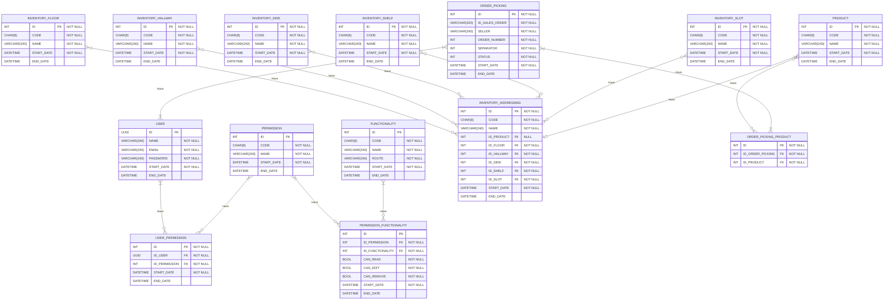

```mermaid
erDiagram

    USER }|--o{ USER_PERMISSION : Have
    USER{
        UUID            ID          PK
        VARCHAR(240)    NAME        "NOT NULL"
        VARCHAR(240)    EMAIL       "NOT NULL"
        VARCHAR(240)    PASSWORD    "NOT NULL"
        DATETIME        START_DATE  "NOT NULL"
        DATETIME        END_DATE
    }

    PERMISSION }|--o{ USER_PERMISSION : Have
    PERMISSION }|--o{ PERMISSION_FUNCTIONALITY : Have
    PERMISSION{
        INT             ID          PK
        CHAR(8)         CODE        "NOT NULL"
        VARCHAR(240)    NAME        "NOT NULL"
        DATETIME        START_DATE  "NOT NULL"
        DATETIME        END_DATE
    }
    
    FUNCTIONALITY }|--o{ PERMISSION_FUNCTIONALITY : Have
    FUNCTIONALITY{
        INT             ID          PK
        CHAR(8)         CODE        "NOT NULL"
        VARCHAR(240)    NAME        "NOT NULL"
        VARCHAR(240)    ROUTE       "NOT NULL"
        DATETIME        START_DATE  "NOT NULL"
        DATETIME        END_DATE
    }

    PERMISSION_FUNCTIONALITY{
        INT             ID                  PK
        INT             ID_PERMISSION       FK  "NOT NULL"
        INT             ID_FUNCTIONALITY    FK  "NOT NULL"
        BOOL            CAN_READ                "NOT NULL"
        BOOL            CAN_EDIT                "NOT NULL"
        BOOL            CAN_REMOVE              "NOT NULL"
        DATETIME        START_DATE              "NOT NULL"
        DATETIME        END_DATE
    }

    USER_PERMISSION{
        INT             ID              PK      "NOT NULL"
        UUID            ID_USER         FK      "NOT NULL"
        INT             ID_PERMISSION   FK      "NOT NULL"
        DATETIME        START_DATE              "NOT NULL"
        DATETIME        END_DATE
    }

    INVENTORY_FLOOR }o--o{ INVENTORY_ADDRESSING : Have
    INVENTORY_FLOOR{
        INT             ID         PK   "NOT NULL"
        CHAR(8)         CODE            "NOT NULL"
        VARCHAR(240)    NAME            "NOT NULL"
        DATETIME        START_DATE      "NOT NULL"
        DATETIME        END_DATE
    }

    INVENTORY_HALLWAY }o--o{ INVENTORY_ADDRESSING : Have
    INVENTORY_HALLWAY{
        INT             ID         PK   "NOT NULL"
        CHAR(8)         CODE            "NOT NULL"
        VARCHAR(240)    NAME            "NOT NULL"
        DATETIME        START_DATE      "NOT NULL"
        DATETIME        END_DATE
    }

    INVENTORY_SIDE }o--o{ INVENTORY_ADDRESSING : Have
    INVENTORY_SIDE{
        INT             ID         PK   "NOT NULL"
        CHAR(8)         CODE            "NOT NULL"
        VARCHAR(240)    NAME            "NOT NULL"
        DATETIME        START_DATE      "NOT NULL"
        DATETIME        END_DATE
    }

    INVENTORY_SHELF }o--o{ INVENTORY_ADDRESSING : Have
    INVENTORY_SHELF{
        INT             ID         PK   "NOT NULL"
        CHAR(8)         CODE            "NOT NULL"
        VARCHAR(240)    NAME            "NOT NULL"
        DATETIME        START_DATE      "NOT NULL"
        DATETIME        END_DATE
    }

    INVENTORY_SLOT }o--o{ INVENTORY_ADDRESSING : Have
    INVENTORY_SLOT{
        INT             ID         PK   "NOT NULL"
        CHAR(8)         CODE            "NOT NULL"
        VARCHAR(240)    NAME            "NOT NULL"
        DATETIME        START_DATE      "NOT NULL"
        DATETIME        END_DATE
    }

    PRODUCT }|--o| INVENTORY_ADDRESSING : Have
    PRODUCT }o--o{ ORDER_PICKING_PRODUCT : Have
    PRODUCT{
        INT             ID         PK   "NOT NULL"
        CHAR(8)         CODE            "NOT NULL"
        VARCHAR(240)    NAME            "NOT NULL"
        DATETIME        START_DATE      "NOT NULL"
        DATETIME        END_DATE
    }

    INVENTORY_ADDRESSING{
        INT             ID         PK   "NOT NULL"
        CHAR(8)         CODE            "NOT NULL"
        VARCHAR(240)    NAME            "NOT NULL"
        INT             ID_PRODUCT  FK  "NULL"
        INT             ID_FLOOR    FK  "NOT NULL"
        INT             ID_HALLWAY  FK  "NOT NULL"
        INT             ID_SIDE     FK  "NOT NULL"
        INT             ID_SHELF    FK  "NOT NULL"
        INT             ID_SLOT     FK  "NOT NULL"
        DATETIME        START_DATE      "NOT NULL"
        DATETIME        END_DATE
    }

    ORDER_PICKING }|--|{ ORDER_PICKING_PRODUCT : Have
    ORDER_PICKING }|--|{ USER : Have
    ORDER_PICKING{
        INT             ID              PK  "NOT NULL"
        VARCHAR(320)    ID_SALES_ORDER      "NOT NULL"
        VARCHAR(240)    SELLER              "NOT NULL"
        INT             ORDER_NUMBER        "NOT NULL"
        INT             SEPARATOR           "NOT NULL"
        INT             STATUS              "NOT NULL"
        DATETIME        START_DATE          "NOT NULL"
        DATETIME        END_DATE
    }

    ORDER_PICKING_PRODUCT{
        INT             ID                  PK  "NOT NULL"
        INT             ID_ORDER_PICKING    FK  "NOT NULL"
        INT             ID_PRODUCT          FK  "NOT NULL"
    }
    
```

