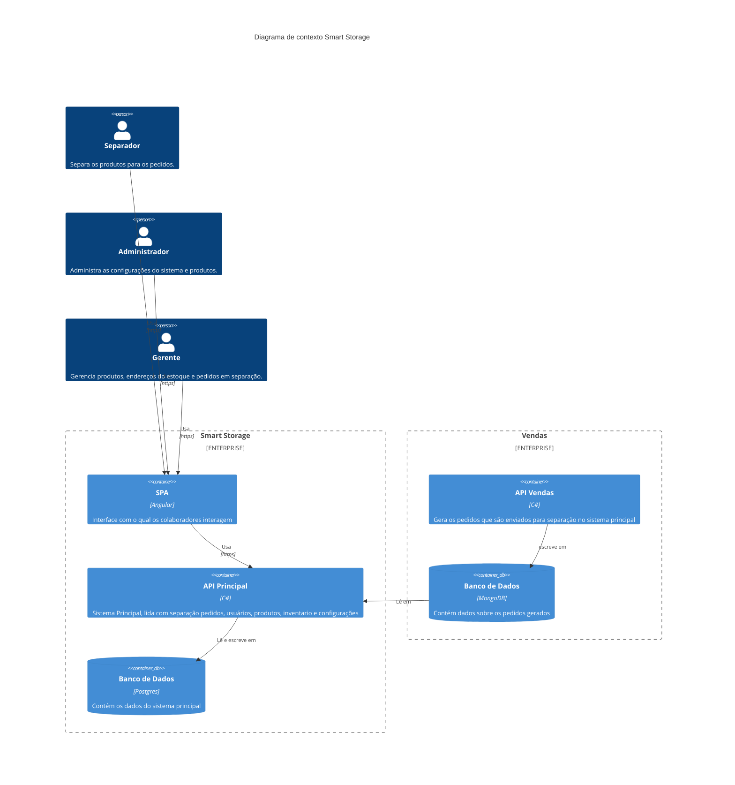

```mermaid
    C4Context 
      title Diagrama de contexto Smart Storage 


      Person(separador, "Separador", "Separa os produtos para os pedidos.")
      Person(adm, "Administrador", "Administra as configurações do sistema e produtos.")
      Person(gerente, "Gerente", "Gerencia produtos, endereços do estoque e pedidos em separação.")
    
        Enterprise_Boundary(internal, "Smart Storage"){
            Container(spa, "SPA", "Angular", "Interface com o qual os colaboradores interagem")
            Container(apip, "API Principal", "C#", "Sistema Principal, lida com separação pedidos, usuários, produtos, inventario e configurações")

            ContainerDb(db, "Banco de Dados", "Postgres", "Contém os dados do sistema principal")

            Rel(separador, spa, "Usa", "https")
            Rel(adm, spa, "Usa", "https")
            Rel(gerente, spa, "Usa", "https")

            Rel(spa, apip, "Usa", "https")
            Rel(apip, db, "Lê e escreve em",)

        }

        Enterprise_Boundary(vendas, "Vendas"){
            Container(apivendas, "API Vendas", "C#", "Gera os pedidos que são enviados para separação no sistema principal")

            ContainerDb(dbmongo, "Banco de Dados", "MongoDB", "Contém dados sobre os pedidos gerados")

            Rel(apivendas, dbmongo, "escreve em")
            Rel(dbmongo, apip, "Lê em")
        }
      


```

